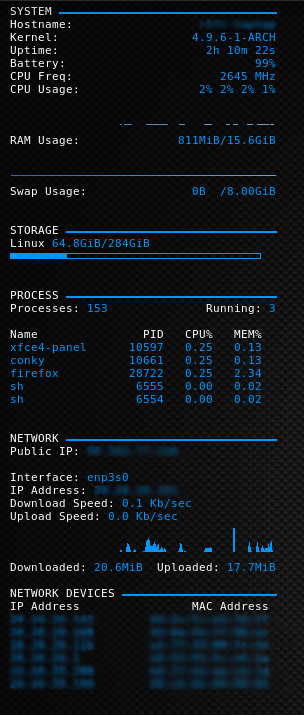
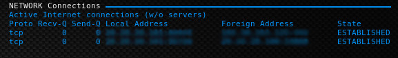

# conky-config
Conky Config

nmap.pl by iltiscat

# Screen Shots



Add get_network to crontab to auto update network info

crontab -e
``` 
* * * * * ~/.conky/get_network
```

# Dependancies:
```
curl
ip
nmap
crontab
```
